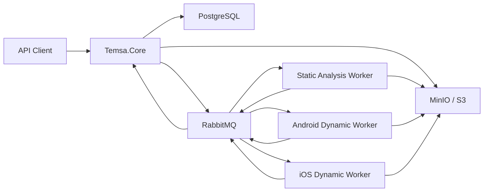

# Temsa

Temsa is a platform for automated security analysis of mobile applications.

The project is built around a control-plane backend and isolated analysis workers. `Temsa.Core` exposes the REST API, manages projects, uploaded artifacts, scans, scan tasks, worker events, and scan artifacts. Workers consume scan tasks from RabbitMQ, run analysis tools, upload generated artifacts to S3-compatible storage, and report progress/results back to Core.

## Architecture



## Components

### Temsa.Core

`Temsa.Core` is the backend control plane.

It is responsible for:

- project management;
- project artifact upload;
- scan creation and execution;
- scan pipeline loading;
- scan task dispatching;
- worker event processing;
- scan task status updates;
- scan artifact registration;
- API access to scan tasks, events, and artifacts.

### Temsa.Worker.Runtime

Shared worker runtime used by analysis workers.

It provides:

- RabbitMQ scan task consumer;
- worker event publisher;
- worker task event sink;
- running task registry;
- task stop handling;
- common worker execution contracts.

### Temsa.Worker.StaticAnalysis

Static analysis worker.

Current capabilities:

- Android SAST with JADX + Semgrep;
- iOS SAST with TruffleHog + radare2;
- S3 upload of generated reports.

### Temsa.Worker.DynamicAnalysis.Android

Android dynamic analysis worker.

Current capabilities:

- APK installation through ADB;
- app data cleanup;
- Frida-based interactive dynamic session;
- logcat capture;
- force-stop;
- private app data dump;
- app uninstall;
- graceful interaction completion through RabbitMQ control messages.

### Temsa.Worker.DynamicAnalysis.Ios

iOS dynamic analysis worker.

Current state:

- Frida-based session support;
- task skeletons for installation, system logs, force-stop, container dump, and uninstall;
- designed to follow the same task model as Android dynamic analysis.

### Temsa.Worker.DynamicAnalysis.Runtime

Shared runtime for dynamic analysis workers.

It contains common Frida and script-loading infrastructure used by Android and iOS workers.

### Temsa.Contracts

Shared contracts for messaging and artifact descriptors.

### Temsa.Common

Shared infrastructure utilities:

- RabbitMQ connection configuration;
- S3-compatible artifact storage;
- common options;
- temporary directory helper;
- time provider.

## Infrastructure

Local infrastructure is defined in `docker-compose.yml`:

- PostgreSQL
- RabbitMQ with management UI
- MinIO
- pgAdmin

Start infrastructure:

```bash
docker compose up -d
```

Default local service ports:

| Service | URL |
| --- | --- |
| PostgreSQL | `localhost:5432` |
| RabbitMQ | `localhost:5672` |
| RabbitMQ Management | `http://localhost:15672` |
| MinIO API | `http://localhost:9000` |
| MinIO Console | `http://localhost:9001` |
| pgAdmin | `http://localhost:5050` |

## Scan Pipelines

Scan execution is described with JSON pipeline files in:

```text
Temsa.Core/Pipelines
```

Current pipelines:

```text
android.static.json
android.dynamic.json
ios.static.json
ios.dynamic.json
```

A pipeline consists of stages and tasks.

Example structure:

```json
{
  "platform": "android",
  "analysisType": "dynamic",
  "stages": [
    {
      "id": "interactive-analysis",
      "order": 2,
      "execution": "parallel",
      "runPolicy": "on-success",
      "tasks": [
        {
          "taskType": "android-dynamic-session",
          "workerType": "android-dynamic-analysis",
          "tool": "frida",
          "order": 1,
          "parameters": {}
        }
      ]
    }
  ]
}
```

### Stage Execution

Stages are executed by `order`.

Supported execution modes:

- `sequential` - tasks are dispatched one by one;
- `parallel` - tasks in the same stage are dispatched together and run concurrently.

### Run Policy

Supported run policies:

- `on-success` - run only if previous stages succeeded;
- `always` - run regardless of previous stage result, useful for cleanup.

## Artifacts

Temsa distinguishes two artifact types.

### Project Artifacts

Project artifacts are uploaded by the user and used as scan inputs.

Examples:

- Android APK;
- iOS IPA;
- source archive.

Project artifacts are stored in S3-compatible storage and tracked in PostgreSQL.

### Scan Artifacts

Scan artifacts are generated by workers during analysis.

Examples:

- Semgrep SARIF report;
- TruffleHog NDJSON report;
- radare2 text report;
- Frida events;
- logcat output;
- private app data archive.

Workers upload scan artifacts to S3 and send artifact descriptors to Core through worker events. Core then registers them in PostgreSQL.

## Worker Events

Workers report task execution state through RabbitMQ.

Typical event flow:

```text
scan-task.started
scan-task.progress
scan-task.log
scan-task.completed
scan-task.failed
```

Events are consumed by `Temsa.Core`, persisted as scan events, and used to update scan/task state.

Completed events may contain scan artifact descriptors. Core registers those descriptors as scan artifacts.

## Worker Control

Dynamic analysis supports control messages through RabbitMQ.

The main use case is completing an interactive analysis stage:

```text
interaction.completed
```

A scan-level interaction completion command can stop all currently running interactive tasks for a scan. Each task receives a stop request and is expected to finish gracefully, upload artifacts, and publish a completed event.

## Frida Scripts

Frida scripts are stored in:

```text
frida-scripts
```

Worker projects do not store generated Frida bundles as source files. During build/publish, MSBuild runs the corresponding npm build command and copies the generated bundle into the worker output directory.

Install Node dependencies once:

```bash
cd frida-scripts
npm install
```

Build scripts manually:

```bash
npm run build:android-basic
npm run build:ios-basic
```

During worker build, bundles are copied into:

```text
Scripts/android/agent.android.basic.bundle.js
Scripts/ios/agent.ios.basic.bundle.js
```

## Static Analysis

### Android Static Analysis

Android SAST currently uses:

- JADX for APK decompilation;
- Semgrep for rule-based static analysis;
- SARIF as report format.

Output artifact:

```text
semgrep-report.sarif
```

### iOS Static Analysis

iOS SAST currently uses:

- TruffleHog for secret scanning;
- radare2 for binary inspection.

Output artifacts:

```text
trufflehog-results.ndjson
radare2-report.txt
```

radare2 scripts are grouped by profiles and can be enabled/disabled per scan task.

## Dynamic Analysis

### Android Dynamic Analysis

Current Android dynamic pipeline includes:

1. install APK;
2. clear app data;
3. run Frida interactive session;
4. capture logcat output;
5. complete interaction through Core API;
6. force-stop app;
7. dump private app data;
8. cleanup app data;
9. uninstall app.

Android dynamic analysis expects:

- connected Android device or emulator;
- ADB access;
- Frida server running on the target device;
- root access for private data dump.

### iOS Dynamic Analysis

iOS dynamic analysis is being developed with a Frida-first approach.

Expected environment:

- connected jailbroken iOS device;
- Frida available on the device;
- optional SSH-based tasks for app container extraction later.

## Development

Restore dependencies:

```bash
dotnet restore
```

Build solution:

```bash
dotnet build
```

Start infrastructure:

```bash
docker compose up -d
```

Run Core:

```bash
dotnet run --project Temsa.Core
```

Run static analysis worker:

```bash
dotnet run --project Temsa.Worker.StaticAnalysis
```

Run Android dynamic worker:

```bash
dotnet run --project Temsa.Worker.DynamicAnalysis.Android
```

Run iOS dynamic worker:

```bash
dotnet run --project Temsa.Worker.DynamicAnalysis.Ios
```

## Example Flow

### 1. Upload an artifact

PowerShell example:

```powershell
$form = @{
    type = "IosIpa"
    kind = "Binary"
    file = Get-Item -Path .\DVIA-v2.ipa
}

Invoke-RestMethod `
    -Uri "http://localhost:8000/projects/3/artifacts" `
    -Method Post `
    -Form $form
```

### 2. Create a scan

Create a scan for the uploaded artifact through the API.

The scan references the uploaded `inputArtifactId`.

### 3. Start the scan

Start the scan through the API.

Core loads the matching scan pipeline, creates scan tasks, and dispatches the first stage to RabbitMQ.

### 4. Complete interactive analysis

For dynamic scans, complete interaction through Core when manual app exploration is finished.

Core publishes a worker control message. Running interactive tasks finish gracefully and upload their artifacts.

### 5. Fetch events and artifacts

Use Core API to inspect:

- scan status;
- scan task status;
- scan task events;
- scan artifacts;
- artifact content.

## Current MVP Scope

Implemented or in progress:

- REST API for projects and scans;
- project artifact upload to S3-compatible storage;
- scan pipeline execution;
- RabbitMQ-based task dispatching;
- worker event ingestion;
- scan artifact registration;
- Android static analysis;
- iOS static analysis;
- Android dynamic analysis;
- iOS dynamic analysis foundation.

## Roadmap

Planned improvements:

- normalized findings model;
- aggregation of raw tool output into findings;
- richer iOS dynamic worker implementation;
- more Android and iOS Frida checks;
- additional radare2 scripts;
- secret scanning for dumped app private data;
- improved scan summaries;
- outbox pattern for reliable message publishing;
- authentication and authorization;
- UI for scan progress and artifacts.
